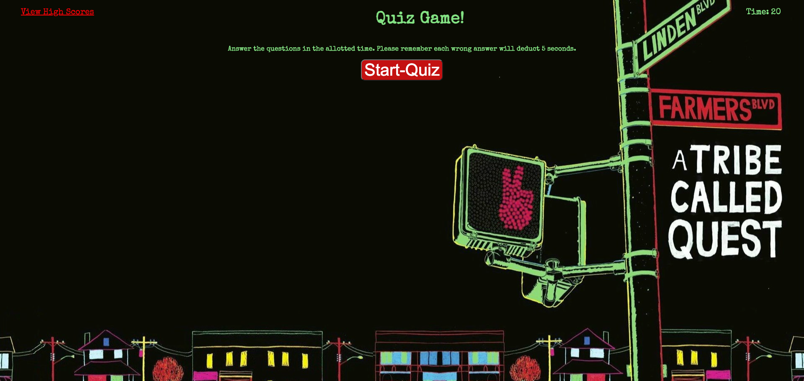
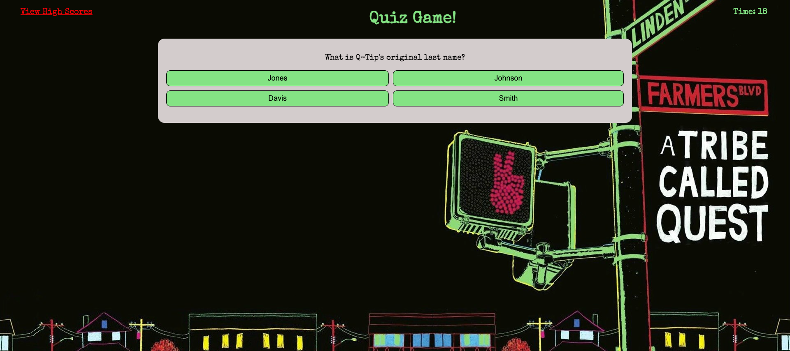
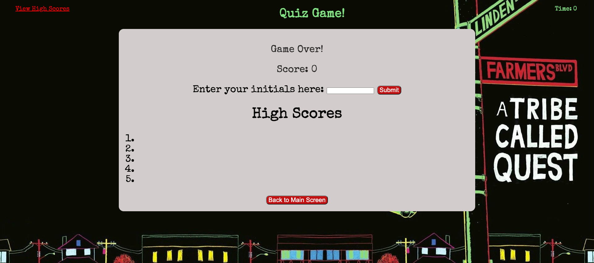

# 04CodeQuiz
Create a Quiz game utilizing an intro screen followed by questions and multiple choice answers. A countdown timer is used and a high scores table is displayed at the end of the game.

## Description
*Intro screen with directions for playing the game and a button to start the game'
*Questions with multiple choice answers are displayed.
*Questions are advanced by clicking an answer.
*At the end of the questions, a score is displayed along with a form to input initials/name for the high scores. 

## Mock-up
The images below shows the webpage created

Start of game

Mid game

End of game

## Location
https://twangerwang.github.io/04CodeQuiz/

## Credits
background found online for free use

## License
MIT License

Copyright (c) 2022 Teddy Wang

Permission is hereby granted, free of charge, to any person obtaining a copy
of this software and associated documentation files (the "Software"), to deal
in the Software without restriction, including without limitation the rights
to use, copy, modify, merge, publish, distribute, sublicense, and/or sell
copies of the Software, and to permit persons to whom the Software is
furnished to do so, subject to the following conditions:

The above copyright notice and this permission notice shall be included in all
copies or substantial portions of the Software.

THE SOFTWARE IS PROVIDED "AS IS", WITHOUT WARRANTY OF ANY KIND, EXPRESS OR
IMPLIED, INCLUDING BUT NOT LIMITED TO THE WARRANTIES OF MERCHANTABILITY,
FITNESS FOR A PARTICULAR PURPOSE AND NONINFRINGEMENT. IN NO EVENT SHALL THE
AUTHORS OR COPYRIGHT HOLDERS BE LIABLE FOR ANY CLAIM, DAMAGES OR OTHER
LIABILITY, WHETHER IN AN ACTION OF CONTRACT, TORT OR OTHERWISE, ARISING FROM,
OUT OF OR IN CONNECTION WITH THE SOFTWARE OR THE USE OR OTHER DEALINGS IN THE
SOFTWARE.